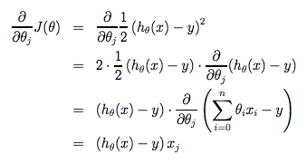

## Week1

### Cost function: 
We can measure the accuracy of our hypothesis function by using a cost function. This takes an average difference (acutally a fancier version of an average) of all the results of the hypothesis with inputs from x's and the acutal output y's

\\(J(\theta_0, \theta_1)= \frac{1}{2m}\sum_{i=1}^{m}(\hat{y_i}-y_i)^2 = \frac{1}{2m}\sum_{i=1}^{m}(h_\theta(x_i)-y_i)^2\\)

With gradient decent: 

Simultaneous update: 

```
\\(temp0: = \theta_0 - \alpha\frac{\partial}{\partial\theta_0}J(\theta_0, \theta_1)\\)
\\(temp1 : = \theta_1 - \alpha\frac{\partial}{\partial\theta_1}J(\theta_0, \theta_1)\\)
\\(\theta_0 := temp0\\)
\\(\theta_1 := temp1\\)
```

Partial derivation process: 




Put together: 


CodeLink: [gradientDescentMulti.m](https://github.com/ZhuEthan/MachineLearningStudy/blob/master/machine-learning-ex1/ex1/gradientDescentMulti.m)
