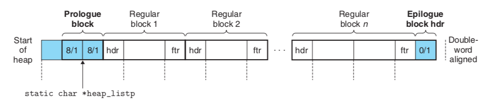
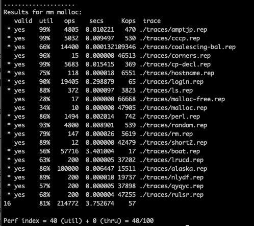
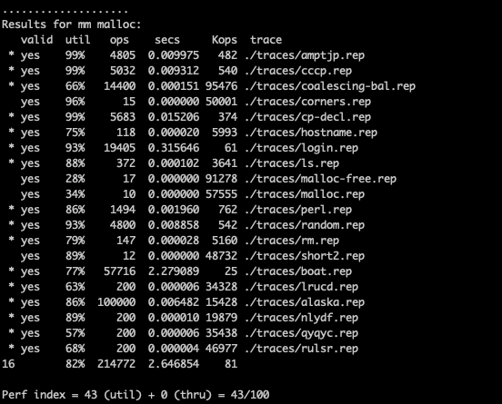
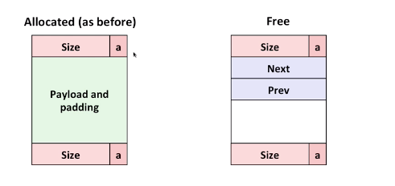
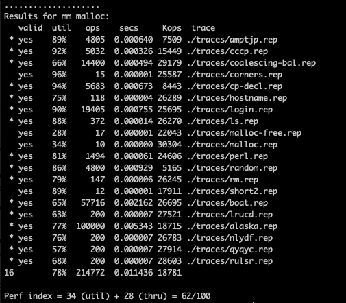
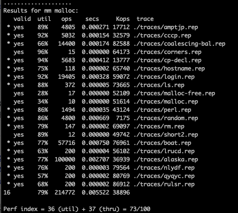

It has been two months since I left US Amazon for visa issue. Still waiting for my CA visa. During the temporary leaving time, I decided to review my knowledge of computer architecture. Here I demonstrated the lab "malloc" as it involves some design thinking. Stages are listed one by one as below

#### Implicit linked list: 
The implicit linked list is the easiest implementation of malloc, the underground data structure is an array of memory. The memory is split into blocks bounded by hdr and ftr accomodating size/allocation bits. The allocation bit could be 0 or 1, 0 represents the related block is free and 1 represents not free. The size bit is just the binary number representing the size of the related block. Whenever a given size consecutive memory is requested (malloc), a free block will be filtered out from the whole implicit linked list and be marked as allocated with the requested size. In a similar way, the "free" request will claim back the already allocated memory (change the allocation bit back to 0). The overall structure of implicit memory list is as below: 


image 1


The hdr(header) and ftr(foot) in the image 1 contains identical info: size and allocation status. The size includes both the data area and foot&header area. A pointer referring to a data block plus size in header / foot will point to the starting point of the next data block. The existence of header and foot is helping travel forward and backward along the list. 

With math notation to represent all relations above: 

```
#define GET_SIZE(p) (GET(p) & ~0x7)
#define GET_ALLOC(p) (GET(p) & 0x1)
// Given data block ptr bp, compute address of its header and footer
#define HDRP(bp) ((char*)(bp) - WSIZE)
#define FTRP(bp) ((char*)(bp) + GET_SIZE(HDRP(bp)) - DSIZE)
// Given data block ptr bp, compute address of next and pre blocks
#define NEXT_BLKP(bp) ((char*)(bp) + GET_SIZE(((char*)(bp) - WSIZE)))
#define PREV_BLKP(bp) ((char*)(bp) - GET_SIZE(((char*)(bp) - DSIZE)))
```
The result util and throughput result for this method is as below: 



#### Improved implicit linked list: 
In the implicit linked list, identical info including size/allocation status is stored twice in both header and foot. Is there any way to reduce this duplication? As this info stored in the foot is to improve simplicity when reverse traversing the linked list, we could remove this duplication for blocks when no reverse traversing is needed. It is worth noticing that reverse traversing only happenes when the prev block is free and coalesce needs to be happening. Thus, the foot block could be removed when the prev block is malloced. In order to know whether prev block has been allocated or not without foot info, an extra bit is being stored in the header (thinking header was storing size | cur-alloc) so that header turns into size | cur-alloc | prev-alloc. With the extra prev-alloc info, reverse traversing could decide whether the foot in the prev block is existent or not. 

The final util scores increase from 81% to 82% with this improvement. 



#### Explicit free linked list
Ahhhh, could we become faster? Looks like we waste a lot of time traversing the whole memory especially on double checking the allocated ones which we don't have to, at least this is a time we can save? Yeah, it is right, we could leverage explicit linked list to skip allocated block and just check the free blocks on size specifically. 



Since we only need to link the free blocks, we could leveage the free space which is supposed to accomodate user data to store the address of the next / prev free blocks. That's exactly why it is called explicit free linked list. 

The result is optimistic:



Could we optimise this a little bit more? Definitely! Consider pointer on 64 bit wise machine will take 8 bytes, which greatly increase the minimum free space size which doesn't have to considering our task here doesn't require 2^64 addressing ability. Could we reduce this number by only storing the offset to the next / prev free block which is 4 bytes under the scenarios of this assignment? Here we go! Space util get increased a lot: 



#### seglist

Ha!! Looks like we always spend O(n) time on traversing a long list to find a fitting free blocks? If we could aggregate similar size's blocks together and only travel the segment list best fitting the potential alloc size, we could save time a lot. How will we segmentate the list? One classic way is to split sizes exponentially: the first list hdr points to the free blocks size 1, the second is for size 2-3, the third is for 4-7... Given a request for block size n, we will locate its list by looking at where the most significant 1 in the binary representation of the size. e.g. 8(1000) will be on 4th list whose size range is 8-15. 

As mentioned in the last paragraph, We store these predefined list header on the start of the page. The final performance is: 
