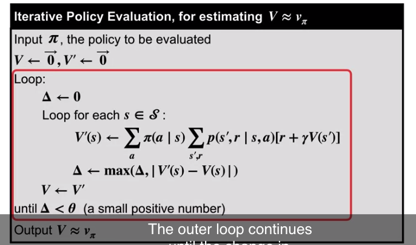
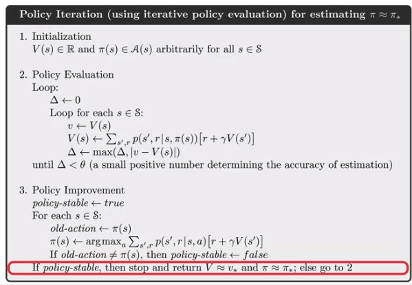
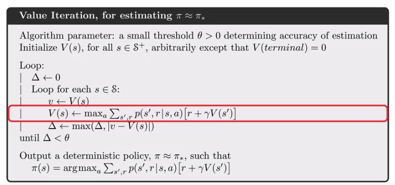

## Week1
**Supervised learning:** labeled data. 
**Reinforment learning:** Rewards gives agent some ideas how good or bad its recent actions were. What a good behavior looks like but can't tell you exactly how to do it. 
**Unsupervised learning:** extract underline structure of the data, it is about the data representation. 

These examples share features that are so basic that they are easy to overlook. All involve interaction between an active decision-making agent and its environment, within which the agent seeks to achieve a goal despite uncertainty about its environment. The agent’s actions are permitted to affect the future state of the environment (e.g., the next chess position, the level of reservoirs of the refinery, the robot’s next location and the future charge level of its battery), thereby affecting the actions and opportunities available to the agent at later times. Correct choice requires taking into account indirect, delayed consequences of actions, and thus may require foresight or planning.

All these examples involve goals that are explicit in the sense that the agent can judge progress toward its goal based on what it can sense directly

The most important feature distinguishing reinforcement learning from other types of learning is that it uses training information that evaluates the actions taken rather than instructs by giving correct actions

nonstationarity

In the k-armed bandit problem, we have an **agent** who chooses between "k" **actions** and receives a **reward** based on the action it chooses. The role of the agent is played by a doctor. 

* The value is the expected reward
\\[q_*(a) \doteq E[R_t|A_t=a]  \forall a \in \{1, ...k\} = \sum_rp(r|a)r\\]
* The gola is to maximize the expected reward. 

Summary: 
* Decision making under uncertainty can be formalized by the k-armed bandit problem
* Fundamental ideas: actions, rewards, value functions. 

By the end of this vidoe, you will be able to...
* Estimate action values using the sample-average method. 
* Describe greedy action selection. 

Value of an Action
* The value of an action is the expected reward when that action is taken

\\[q_*(a) \doteq E[R_t|A_t=a]\\]
* Value is not known, so we estimate it. 

Ways to learn action values: 
* Sample-Average Method \\(Q_t(a) \doteq \frac{sum of rewards when a taken prior to t}{number of times a taken prior to t}\\) => \\(Q_{n+1} = Q_n + \frac{1}{n}(R_n-Q_n)\\)
* Decaying past rewards: \\(Q_{n+1}=a_n(R_n-Q_n)\\) (A constant stepsize parameter can be used to solve a non-stationary bandit problem (that is, for bandit problems in which the reward probabilities do change over time.))

Explore vs Exploit

How to ecnourage explore: 
* Optimistic Initial Values:
	* Limitation: only drive early exploration; Not well-suited for non-stationary problems; We may not know what the optimistic initial value should be
* UCB (Upper-Confidentce Bound). 

Policy: 

Online Learning: 

## Week 2:
Finite Markov Decision Process: 

k-armed bandit doesn't solve
* different situation call for different responses
* The action we choose now influence the reward we can get into the future. 

MDPs are a classical formalization of sequential decision making, where actions influence not just immediate rewards. 

In this case, the random variables \\(R_t\\) and \\(S_t\\) have well defined discrete probability distributions dependent only on the preceding state and action.

\\[ p(s',r \vert s,a) \doteq Pr(S_t=s',R_t=r \vert S_{t-1}=s,A_{t-1}=a) \\]

Episodic and continuing tasks: 

* Interaction break naturally into episodes. 
* Each episode ends in a terminal state
* Episodes are independent

Continuing Tasks: 
* Interaction goes on continually. 
* No terminal state. 

## Week 3

Formally, a policy is a mapping from states to probabilities of selecting each possible action.

**Policy** is a distribution over actions for each possible state. 
* **Deterministic** policy notation (only one possible action on a given state): 
\\[\pi(s) = a\\]
* **Stochastic** policy 
\\[\pi(a|s) \geq 0\\]

State-value functions, Action-value function. 

**Bellman equation**

\\(v_\pi \doteq E_\pi[G_t \vert S_t=s] = \sum_a\pi(a \vert s)\sum_{s'}\sum_rp(s', r \vert s, a)[r+\gamma v_\pi(s')\\)

\\(q_\pi(s, a) \doteq E_\pi[G_i \vert S_t=s, A_i=a] = \sum_{s'}\sum_r p(s', r \vert s, a)[r+\gamma\sum_{a'}q_\pi(s', a')]\\)

**Why bellman Equation:** 

Bellman Equations to solve for a value function by writing a system of linear equations. (if we know the policy)

**Optimal policy**

* An optimal policy is defined as the policy with the highest possible value function in all states
* At least one optimal policy always exists, but there may be more than one. 
* The exponential number of possible policies makes searching for the optimal policy by brute-force intractable. 

#### Optimal Value Functions

\\[ v_* (s) = max_a \sum_{s'} \sum_{r}p(s', r \vert s, a)[r+\gamma v_{*}(s')] \\]

\\[ q_* (s,a) = \sum_{s'} \sum_{r}p(s', r \vert s, a) [r + \gamma max_{a'} q_* (s', a')] \\]

We can get \\( \pi_* \\) easily with given \\( v_* (s) \\)

Reinforment learning's goal is to find the optimal policy

## Week 4 Dynamic Programming: 

The term dynamic programming (DP) refers to a collection of algorithms that can be used to compute optimal policies given a perfect model of the environment as a Markov decision process (MDP) assuming the best possible case that we know how the MDP is working.

Classical DP algorithms are of limited utility in reinforcement learning both because of their assumption of a perfect model and because of their great computational expense, but they are still important theoretically

#### Policy Evaluation
First we consider how to compute the state-value function \\(v_\pi\\) for an arbitrary policy \\(\pi\\). This is called policy evaluation in the DP literature. We also refer to it as the prediction problem.

image 1

We can turn the Bellman equation into an update ruls, to iteratively compute value functions. 

Policy Improvement Theorem

\\[q_\pi (s, \pi'(s)) \geq q_\pi(s, \pi(s)) for all s \in S\\]

* The greedified policy is a strict improvement. 
* Use the value function under a given policy, to produce strictly better policy

**Policy Iteration**

* **Policy iteration algorithm** for finding the optimal policy
* Policy Iteration works by alternating policy evaluation and policy improvement. 
* Policy Iteration follows a sequence of better and better policies and value functions until it reaches the optimal policy and associated optimal value function. 

Flexibility:

#### Asychronous DP
* Asynchronous DP algorithms are in-place iterative DP algorithms that are not organized in terms of systematic sweeps of the state set.
#### Synchronous DP
* A major drawback to the DP methods that we have discussed so far is that they involve operations over the entire state set of the MDP, that is, they require sweeps of the state set. If the state set is very large, then even a single sweep can be prohibitively expensive

Efficiency of Dynamic Programming: 

* **Monte Carlo method**: Get a large number of returns for each states and calcuate its average for state value. 
* ==> **Dynamic Programming**: Bootstrapping current state value by next states value instead of estimating state value independently. (Should be more efficient)
* Brute-Force Search: In order to find optimal policy, time-complexity is exponential to the number of states. 
* ==> Policy Iteration: Polynomial time in |S| and |A|, exponential faster than Brute-Force

The curse of dimensionality

The size of the state space grows exponentially as the number of relevant features increases
This is not an issue with Dynamic Programming, but an inherent complexity of the problem. 

**Jack’s Car Rental:**
* States: Two location, maximum of 20 cars at each
* Actions: Move up to 5 cars between locations overnight
* Reward: $10 for each car rented (must be available)
* Transitions: Cars returned and requested randomly
	* Poisson Distribution, n returns/requests with prob $(\lambda/n!) e^{-\lambda}$
	* 1st location: average requests = 3, average returns = 3
	* 2nd location: average requests = 4, average returns = 2

Solution: 

https://medium.com/@jaems33/this-is-start-of-my-exploration-into-learning-about-reinforcement-learning-d505a68a2d6

**When is dynamic programming converged?**

https://en.wikipedia.org/wiki/Stochastic_approximation#Convergence_of_the_algorithm

\\( \sum_{n=1}^\infty \alpha_n(a)= \infty\\) and \\( \sum_{n=1}^{\infty} \alpha^2_n(a) < \infty\\)

**Gamblers Problem**
https://github.com/dennybritz/reinforcement-learning/blob/master/DP/Gamblers%20Problem%20Solution.ipynb

