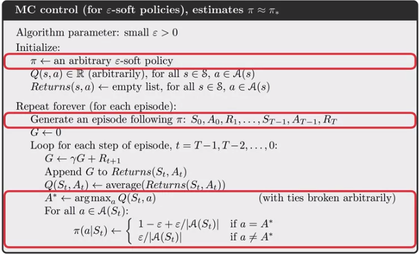
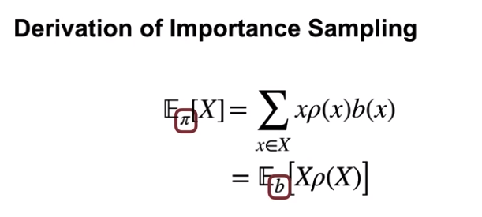
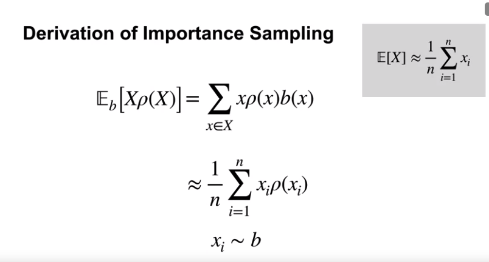

## Week1

In RL Monte Carlo methods allow us to estimate values (Not to get best policy) directly from experience, from sequences of states, actions and rewards. Learning from experience is striking because the agent can accurately estimate a value function without prior knowledge of the environments dynamics 

* To evaluate state value, we need to know transition probabilities before DP. e.g. BlackJack: suppose the player’s sum is 14 and he chooses to stick. What is his probability of terminating with a reward of +1 as a function of the dealer’s showing card? All of the probabilities must be computed before DP can be applied, and such computations are often complex and error-prone.

Monte Carlo methods estimate values by averaging over a large number of random samples. 

Use Monte-Carlo Prediction to estimate the value function for a given policy. 

Undiscounted MDP where each game of blackjack corresponds to an episode. [example is interesting.]

Implications of Monte Carlo learning. 
* We do not need to keep a large model of the environment
* We are estimating the value of an individual state independently of the values of other states. 
* The computation needed to update the value of each state does not depend on the size of the MDP. Instead, it depends on the length of the episodes.

Monte Carlo VS DP: 
* Ability to learn from actual experience
* From simulated experience
* Note that the computational expense of estimating the value of  a single state is independent of the number of states. This can make Monte Carlo methods particularly attractive when one requires the value of only one or a subset of states

Off-policy learning VS On-policy learning? 

Using Monte Carlo for Action-Values

Action-values are useful for learning a policy. 

Exploring Starts: 
Random. 

How to use Monte Carlo methods to implement a Generalized Policy Iteration (GPI) algorithm. 

Exploring Starts is not a practical in every case. So we introduce \\(\epsilon\\)-soft policy

\\(\epsilon\\)-Greedy policies \\(\subset\\) \\(\epsilon\\)-soft policies 

**Why does off-policy learning for prediction:**

[On-policy vs off-policy](https://towardsdatascience.com/on-policy-v-s-off-policy-learning-75089916bc2f#:~:text=Target%20Policy%20pi%28a%7Cs,to%20interact%20with%20the%20environment.)
* On-Policy: Improve and evaluate the policy being used to select actions. 
* Off-Policy: Improve and evaluate a different policy from the one used to select actions

Target Policy: It is the policy that an agent is trying to learn i.e agent is learning value function for this policy.

Behavior Policy(Control Policy): 1. It is the policy that is being used by an agent for action select i.e agent follows this policy to interact with the environment.

Importantce Sampling:
* Use importance sampling to estimate the expected value of a distribution using samples from a different distribution

Off-policy-MC-prediction

## Week2 Temporal Difference Learning

temporal difference learning definition: 

\\(V(S_t)\\) <- \\(V(S_t) + \alpha[R_{t+1} + \gamma V(S_{t+1})-V(S_t)]\\)

Specialize in **multi-step** prediction learning

_learning.png)

Advantages of temporal difference learning: 
* Do not require a model of the environment. 
* Online and incremental
* Coverge faster than MC Methods

[Batch TD(0)](https://stats.stackexchange.com/questions/297708/batch-reinforcement-learning-algorithm-example)

## Week3 Sarsa: GPI with TD

Q-learning is learning the best action it could take instead of the action it actually takes --> it is a off-policy learning. 

