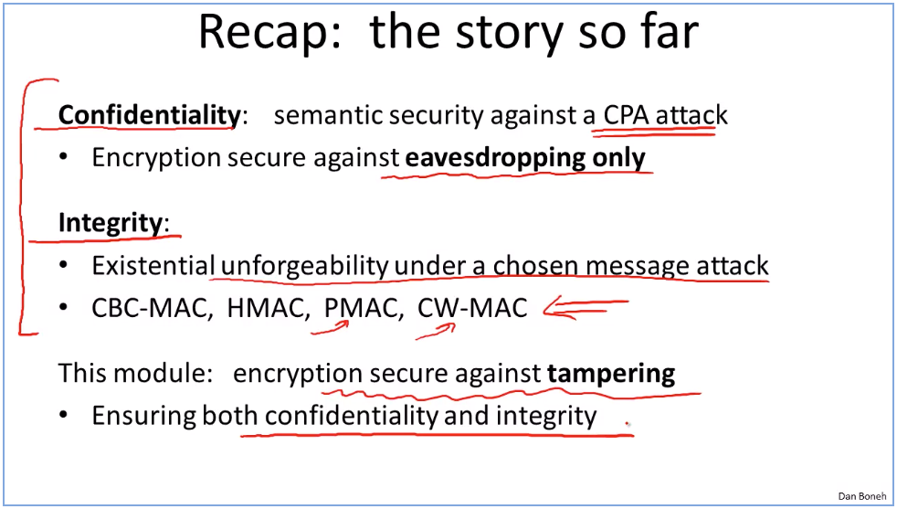
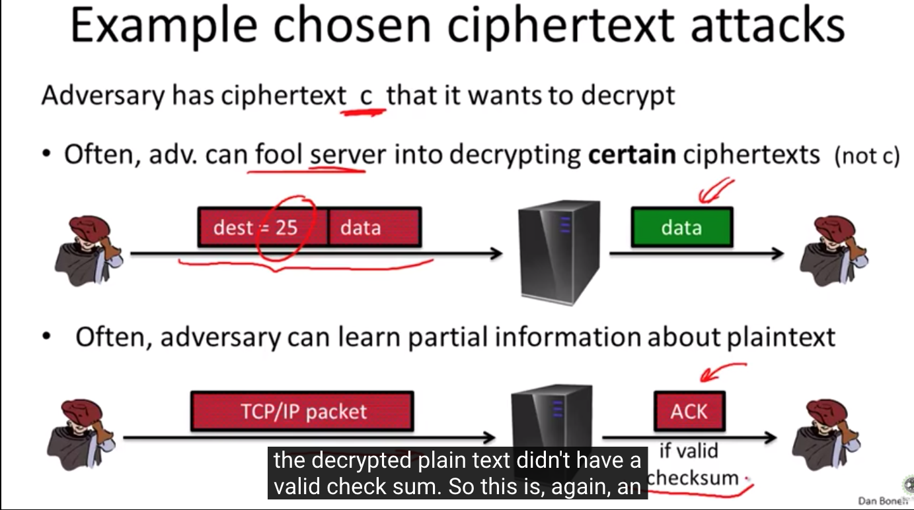
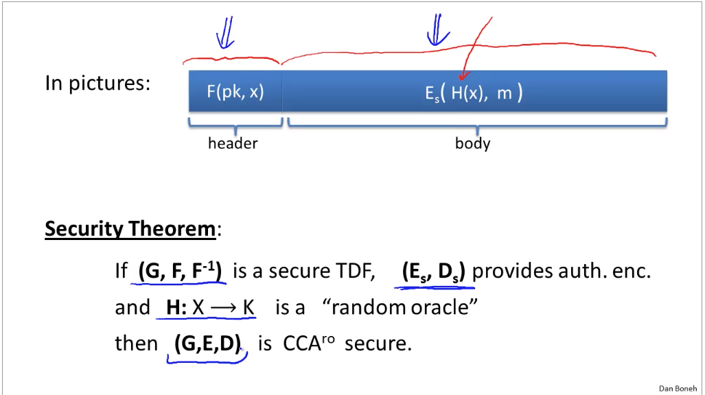
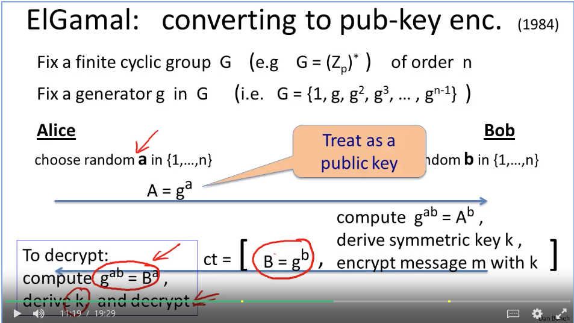

# Week1: 

Secure communication: 

- Web traffic: HTTPS (SSL/TLS)
- Wireless traffic: 802.11i WPA2, GSM, Bluetooth. 

Encryption files on disk: EFS, TrueCrypt

Content protection (e.g. DVD -> CSS, Blu-rey->AACS):

TSL: 
* Handshake protocal: establish shared secret key using public-key cryptography. 
* Record Layer: Transmit data using shared secret key, ensure confidentiality. 

* confidentiality and integrity: 
* Degital signatures
* Anonymous communication
* Secret multi-party party
	* Elections
	* Private auction
* Privately outsourcing computation
* Zero knowledge

Thm: Anything the can done with trusted auth, can also be done without. 

* Precisely specify threat model
* Propose a construction
* Prove that breaking construction under threat mode will solve an underlying hard problem. 

An important property of XOR: 

Thm: Y a rand. var. over \\(\{0,1\}^n\\), X an indep. uniform var. on \\(\{0, 1\}^n\\). Then Z:=Y XOR X is uniform var on \\(\{0, 1\}^n\\)

The birthday paradox

# Week2 Confidentiality

AES & 3DES

How to do Key expansion? https://ritul-patidar.medium.com/key-expansion-function-and-key-schedule-of-des-data-encryption-standard-algorithm-1bfc7476157

Semantic secure: Adversary cannot tell mapping relationships after receiving encryption of messages he sent. However, the adversary could modify the confidential content if he has a little clue where the target byte is. For example, adversary doesn't know which message is port 20, but he could use XOR with encryption key to change the value to 80.

What confidentiality doesn't guarantee is adversary tempering packages on the transfer period. That will be week 4 -- Authenticated

The following also defends the replay attack. 

aes-ctr: https://wizardforcel.gitbooks.io/practical-cryptography-for-developers-book/content/symmetric-key-ciphers/aes-encrypt-decrypt-examples.html

# Week3 Integrity: 

MAC guarantees integrity AND authentication.

difference between resistant hash and mac: https://stackoverflow.com/questions/2836100/what-is-the-difference-between-a-hash-and-mac-message-authentication-code

The main difference is conceptual: while hashes are used to guarantee the integrity of data, a MAC guarantees integrity AND authentication.

This means that a hashcode is blindly generated from the message without any kind of external input: what you obtain is something that can be used to check if the message got any alteration during its travel.

A MAC instead uses a private key as the seed to the hash function it uses when generating the code: this should assure the receiver that, not only the message hasn't been modified, but also who sent it is what we were expecting: otherwise an attacker couldn't know the private key used to generate the code.

> While MAC functions are similar to cryptographic hash functions, they possess different security requirements. To be considered secure, a MAC function must resist existential forgery under chosen-plaintext attacks. This means that even if an attacker has access to an oracle which possesses the secret key and generates MACs for messages of the attacker's choosing, the attacker cannot guess the MAC for other messages without performing infeasible amounts of computation.

My understanding: With CR hash only, attacher could still guess out the hash value for other messages (concatenate other messages with calculated hash) They just cannot forge a different message but the same hash value to fool receiver. With Mac, adversary cannot forge another <key,tag> pairs based on receivable <key, tag> info

# Week4 Authentication

Authentication = Integrity + Confidentiality

## Searching on encrypted data

## Disk encryption: no expansion. 

# Week5: Basic Key exchange. 

Eavesdropper attack: no tampering, no dropping, no replaying, just intercept and try to get the shared key between Alice and Bob. 

Public-Key Encryption: 

How to construct CCS asyn algo: (doesn't avoid active attack risk)

TDF: 

How does SSL work? 

The server sends its public key to the browser, the browser chooses a secret and then encrypts the secret using the server's public key, sends it back to the server, the server decrypts and now both the borwser and the server have a common secret that they can then use to encrypt data, going backand forth, between them. 

In fact, to avoid middleman attack, the `public key` sent by server is a digital certificate (a public key with origin name encrypted by Certificate Authority's private key). The web browser has the paired CA's public key to decrpyte the digital certificate to get the server public key and do the following. 

## Week 7 Digital Signatures

* Even after observing signatures on multiple messages, an attacker should be unable to forge a valid signature on a new message. 

## SSL/TLS:

* How can you securely send your credit card to Coursera? 

